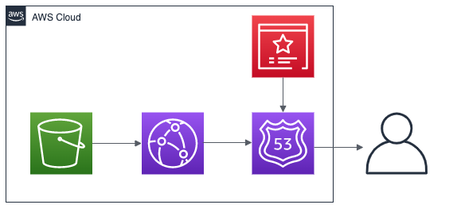
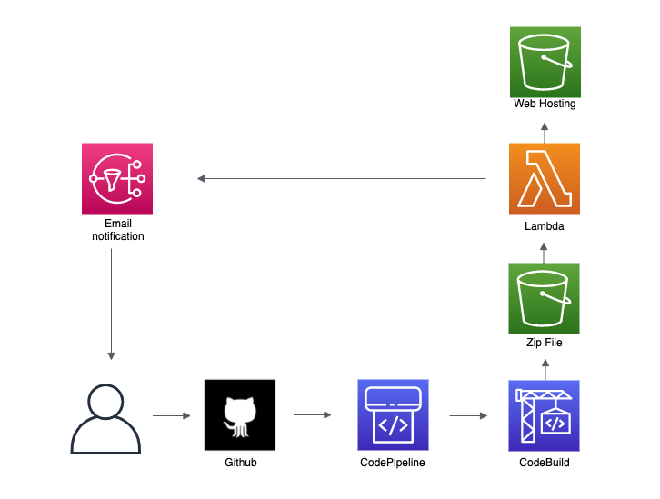

# Portfolio Website

## Introduction

Want to get to know who Kevin Tran is or launch your own portfolio website in an automated fashion?

This project provides a CI/CD pipeline for deploying a static website using Amazon Web Services.

### Objectives & Key Results

1. Provide a platform to convey a static website.
2. Automated deployment upon pushing to the master branch.

### Key Performance Indicators

1. Deploy the updated version of the website within minutes.

## Launch Configurations

### Pre-requisites

- python == 3.11
- aws-cli
- aws-cdk >= 2.128.0
- git
- jq >= 1.7.1

Run the following command:

```bash
aws configure
```

### Deployment

Generate the `secret_env.sh` using the following commands:

```bash
EMAIL=test@example.com
GITHUB_OWNER="example"
GITHUB_REPO="my-portfolio"
./scripts/generate_secret_env.sh $EMAIL $GITHUB_OWNER $GITHUB_REPO
```

Then, run the following command to build and deploy the portfolio application:

```bash
./scripts/deploy.sh
```

### Teardown

## Architecture Overview

### Code Layout

| Path         | Description                                                    |
| :----------- | :------------------------------------------------------------- |
| cdk/         | AWS CDK source code                                            |
| cicd/        | Lambda and CodeBuild processing code                           |
| docs/assets/ | supporting assets for documentation.                           |
| frontend/    | source code for React frontend                                 |
| scripts/     | shell scripts to build, deploy, and interact with the project. |

### Architecture Diagram

**Frontend**

This website is hosted using Amazon Web Services.

1. Amazon Route 53 for DNS routing
2. Amazon CloudFront for content distribution and caching
3. AWS Certificate Manager for TLS/SSL security
4. Amazon S3 to host static websites



**CI/CD**

Behind the scenes we are using the following services to automate deployment whenever updates are pushed to the master branch:

1. CodePipeline is notified of the changes in Github.
2. CodeBuild is notified by CodePipeline and zips the files together into an S3 bucket.
3. Lambda takes the S3 zip file and unzips it in the static hosted S3 bucket.
   After this is processed, lambda uses SNS to notify me about the deployment success.


