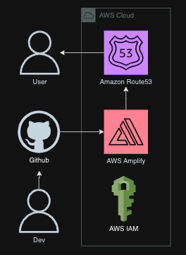

# Portfolio Website

## Introduction

Want to get to know who Kevin Tran is or launch your own portfolio website in an automated fashion?

This project provides a CI/CD pipeline for deploying a portfolio website using Amazon Web Services.

### Objectives & Key Results

1. Provide a platform to convey a portfolio website.
2. Automated deployment upon pushing to the master branch.
3. Including a development branch that is password protected.

### Key Performance Indicators

1. Deploy the updated version of the website within minutes automatically.

## Launch Configurations

### Pre-requisites

- python == 3.11
- aws-cli
- aws-cdk >= 2.128.0
- git
- jq >= 1.7.1

Run the following command:

```bash
aws configure
```

### Deployment

1. Create a [GitHub Access Token](https://help.github.com/en/github/authenticating-to-github/creating-a-personal-access-token-for-the-command-line), with scopes repo and admin:repo_hook.

2. Register an API key and verify your domain through [resend](https://resend.com/docs/send-with-nextjs) for email setup.

3. Register a [Route 53](https://aws.amazon.com/route53/) domain.

4. Generate the `secret_env.sh` using the following commands:

```bash
GITHUB_REPO="my-portfolio"
GITHUB_TOKEN="example"
DOMAIN_NAME="example.xyz"
USERNAME="example"
PASSWORD="example"
./scripts/generate_secret_env.sh $GITHUB_REPO $GITHUB_TOKEN $DOMAIN_NAME $USERNAME $PASSWORD
```

5. Run the following command to build and deploy the portfolio application:

```bash
./scripts/deploy.sh
```

### Teardown

Run the following command to teardown the portfolio application:

```bash
./scripts/teardown.sh
```

## Architecture Overview

Upon pushing to the Github master branch, Amplify will retrieve the latest branch changes. These changes are processed through a CI/CD pipeline built into AWS Amplify.



### Code Layout

| Path         | Description                                                    |
| :----------- | :------------------------------------------------------------- |
| cdk/         | AWS CDK source code                                            |
| cicd/        | Amplify buildspec code                                         |
| docs/assets/ | supporting assets for documentation.                           |
| frontend/    | source code for NextJS frontend                                |
| scripts/     | shell scripts to build, deploy, and interact with the project. |

### Design Decisions

This portfolio is a static website which is best suited for sever-side rendering. Between ReactJS and NextJS, NextJS offers better server-side rendering. NextJS is a framework used to build UI and pages for the web app within the React Library.
